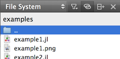
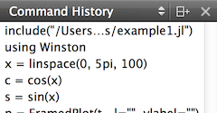
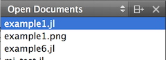
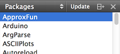
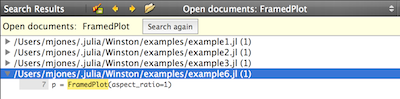
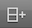
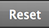
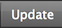

##Julia Studio Help
by Forio

###Contents

* [Installing Julia Studio](#installing-julia-studio)
	* [Downloading and installing](#downloading-and-installing)
	* [Building from source](#building-from-source)
	* [Uninstalling and reinstalling](#uninstalling-and-reinstalling)
	* [Using a different version of Julia](#using-a-different-version-of-julia)
* [Installing packages](#installing-packages)
	* [Installing](#installing)
	* [Fun with packages: Plotting](#fun-with-packages-plotting)
	* [Troubleshooting](#troubleshooting)
* [Workspace](#workspace)
	* [Main Editor](#main-editor)
	* [Sidebar](#sidebar)
	* [Output panes](#output-panes)
	* [Buttons](#buttons) 
* [Menus](#menus)
	* [Configuration: Options / Preferences](#configuration-options-preferences)
	* [File](#file)
	* [Edit](#edit)
	* [Tools](#tools)
	* [Window](#window)
	* [Help](#help) 

###Installing Julia Studio

The current version of Julia Studio is 0.4.4. 

Review the [Release Notes](http://forio.com/products/julia-studio/download/#release-notes) for specific changes since the previous version of Julia Studio.

####Downloading and installing
You can download Julia Studio from Forio: [forio.com/products/julia-studio/download](http://forio.com/products/julia-studio/download). There are current versions for Windows (32bit Win7+, 64bit Win7+), Mac (OSX 10.6, OSX 10.7+), and Linux (Ubuntu 12.04+). To get started, select the appropriate package and follow the on-screen prompts.

Julia Studio installs itself (IDE application), Julia, and Julia packages. By default:

*  The Julia Studio application is installed at:
	* Windows: 
		* 32bit: `C:\Program Files (x86)\Julia Studio\`
		* 64bit: `C:\Program Files\Julia Studio\`
	* Mac: `/Applications/JuliaStudio.app/`
	* Linux: {TBW: pending Stu}
	* You can change the installation location during the installation process by following the on-screen prompts.
*  The Julia binaries are installed at:
	* Windows:
		* 32bit: `C:\Program Files (x86)\Julia Studio\julia\bin\`
		* 64bit: `C:\Program Files\Julia Studio\julia\bin\`
	* Mac: `/Applications/JuliaStudio.app/julia/`
	* Linux: {TBW: pending Stu}
	* You can change the binaries installation location under **Tools > Options... > Julia** (Windows, Linux) or **Julia Studio > Preferences... > Julia** (Mac).
*  Packages are installed at:
	* Windows: `%HOMEPATH%\.julia\` (e.g. `C:\Users\myUser\.julia\`)
	* Mac: `~/.julia/` (e.g. `/Users/myUser/.julia/`)
	* Linux: {TBW: pending Stu}
	* You can change the packages installation location if needed.
		* For Windows, set the `JULIA_PKGDIR` variable to the path to your Julia packages folder. Use **Control Panel > System > Advanced System Settings > Environment Variables** to add the new variable `JULIA_PKGDIR`. 
		
			TIP: If you are having trouble setting the `JULIA_PKGDIR` variable through the Control Panel, you can also set it through the console: `ENV["JULIA_PKGDIR"] = "path-to-your-Julia-packages-folder"`.

####Building from source
Julia Studio is an open source project developed and maintained by Forio on GitHub, under GPL v3. 

If you are interested in building Julia Studio from source, see detailed instructions per platform in the [README.md](https://github.com/forio/julia-studio/blob/master/README.md) in the [Julia Studio GitHub project](https://github.com/forio/julia-studio).

####Uninstalling and reinstalling

**To uninstall Julia Studio:**

* On Windows, use the provided uninstaller (**Control Panel > Programs > Programs and Features > Uninstall**).
* On Mac, drag the JuliaStudio application to the trash. 

User data files are installed in `~/.config/Julia Studio`. If you have uninstalled and reinstalled and are still having issues, try uninstalling and then manually deleting your user data files.

Julia packages are installed in `~/.julia/`. If you have uninstalled and reinstalled and are still having issues, try uninstalling and then manually deleting your packages.

####Using a different version of Julia
[Julia Studio 0.4.4](http://forio.com/products/julia-studio/download/) comes with Julia v0.2 (as released [here](http://julialang.org/downloads/)).

**To use a different version of Julia with Julia Studio:**

1. Select **Tools > Options... > Julia (Win, Linux)** or **Julia Studio > Preferences... > Julia** (Mac).
2. Set the **Path** to your Julia binaries.
3. Select **Apply** and then **OK**. Julia Studio automatically resets your session to reference the new version of Julia. 

	TIP: When you change your version of Julia, Julia Studio *does not take any action on your installed packages*. You may need to [update packages](#installing-packages) (add, remove, or both) to make sure that your package versions are compatible with your version of Julia.

###Installing Packages

All of the official Julia packages (as listed in METADATA.jl) appear in the Julia Studio Packages pane. Packages that you have already installed appear in **bold**.

By default, Julia Studio installs packages in the `.julia` folder in your home directory. You can [change the location](#downloading-and-installing) if needed. For additional information about how packages work with Julia, see the [Julia documentation](http://docs.julialang.org/en/release-0.2/manual/packages/).

####Installing

**To install a package:**

1. Make sure you have an active Internet connection. (Julia Studio retrieves packages from GitHub, based on their listing in METADATA.jl.)
2. In the Packages pane, double-click the package name. Any installation messages appear in the console.

	TIP: The console is an interactive Julia session, so you can also install packages manually using `Pkg.add("PackageName")`.

**To remove a package:**

1. In the Packages pane, double-click the package name. Any removal messages appear in the console.

	TIP: The console is an interactive Julia session, so you can also remove packages manually using `Pkg.rm("PackageName")`.

####Fun with packages: Plotting

Plotting data and creating data visualizations with Julia is a common use case. There are several Julia packages that can help with this, including Winston, Gadfly, and PyPlot. For example, it's easy to create visualizations in Julia Studio using the Winston package.

**To create a plot visualization in Julia Studio:**

1. Add the Winston package.
	A. Make sure you have an active Internet connection.
	B. In the Packages pane, double-click "Winston". By default, the Winston package is installed in the `.julia` folder in your home directory.	

2. Open one of the examples from within the Winston package. The .jl file opens in the main editor.
	A. The Winston package includes several examples ("example1.jl", "example2.jl", etc.) inside the "examples" directory within the package (e.g. `~/.julia/Winston/examples`). 
	
	TIP: If you're on a Mac, directories that start with `.` are hidden by default, so they won't be visible in any of the standard **File** dialogs, including those within Julia Studio. You can show them in Julia Studio's File System pane in the sidebar using the Filter Files icon (). You can also show them by selecting `Command-Shift-.` (period) while the **File** dialog is open. Alternatively, you can copy the `examples` directory to someplace visible. For example, from Terminal: `cp -r ~/.julia/Winston/examples ~/Winston/examples`. 
	
3. Run the example file. 
	A. Click the Run icon () from the status bar within the main editor (**F5**). 
	
4. Open the generated image file.
	A. As you can see from examining its Julia code, each Winston example .jl file ends with the line `file(variable, exampleN.png)`. This creates a .png file in the same directory as the example .jl file.
	B. From the File System pane in the sidebar, double-click the .png file. You'll automatically open the image in a second window within your Julia Studio main editor. 
5. Play with the example; view updates automatically within Julia Studio.
	A. Make changes to the plot in your example .jl file, re-run it, and watch the output change in your open image file.
	B. Optionally, change the name of the output file. Winston supports output to .png, .eps, .pdf, and .svg. (You'll need to double-click each new file from your File System pane to open it within Julia Studio.)

####Troubleshooting
Installing packages requires an active Internet connection. 

In addition, some users have reported difficulty installing packages from behind a firewall. If you are behind a firewall you may have to run this command in your console first: `git config --global url."https://".insteadOf git://`.

###Workspace

The Julia Studio workspace is highly configurable. By default, it includes:

* a [**Main Editor**](#main-editor), where you edit and run one or more open files
* a [**Sidebar**](#sidebar), configurable to list open documents, file system browser, available packages, and command history
* a set of [**Output Panes**](#output-panes), including an interactive console and other system output

####MAIN EDITOR

The main editor is where you edit and run one or more open files. 

By default, this space includes the single, active file. You can split the window (**Window > Split**) if you want to edit multiple files at once.

To execute your code, click the **Run** button () at the top of the active file. 

TIP: You can also run files from the File System pane in the sidebar by selecting the file and then choosing **Run this file** from the context menu, or by using the keyboard shortcut `F5`.
 
TIP: Files that you are editing in the main editor are not automatically available in your console (interactive Julia session). If you are working on a file and want to play with it in the console, you'll need to `include` it at the console before calling functions from or examining variables in the file. From the File System pane in the sidebar, select your file and then choose **Copy absolute path** from the context menu. Then enter `include "<paste absolute path>"` at the console prompt. 

####SIDEBAR

The sidebar is a configurable set of panes that help provide context to your work session by showing open documents, packages, file system, and command history.

Show and hide the sidebar by toggling **Window > Show Sidebar**, or using keyboard shortcut `0` (Ctrl + 0, Cmd + 0).

#####File System Pane
The File System pane lists the files in the current directory and allows you to navigate the file hierarchy. 

To show the File System pane, choose **File System** from the sidebar selector.

Double-click a file from the File System pane to open it in the active window of the [main editor](#main-editor).

Use the context menu (right-click on Win, Ctrl+click on Mac) within the File System pane for additional options for opening files, running files, and changing directories. 

TIP: When you `include` a file at the console, you can use the context menu and select **Copy absolute path** to get the full exact path of the file you want to include.

TIP: When you are working on Windows and want to work with files on a drive other than the `C:\` drive, use the context menu and select **Choose Folder...** to navigate to your other drive.

#####Command History Pane
The Command History pane lists each command entered into the console since you launched Julia Studio. 

To show the Command History pane, choose **Command History** from the sidebar selector.

Click a command from the Command History pane to enter it at the [console](#console) prompt. 

The Command History is cleared when you restart Julia Studio. (Clearing or resetting the console does not clear the command history.) 

#####Open Documents Pane
The Open Documents pane lists all documents open in the current session. Typically this only includes .jl files, but it can also include other types of files -- for example, image files you've created with a [plotting package](#fun-with-packages-plotting), or other code you're incorporating (e.g. C files).

To show the Open Documents pane, choose **Open Documents** from the sidebar selector.

Click a document in the Open Documents pane to view it in the active window of the [main editor](#main-editor).

Use the context menu (right-click on Win, Ctrl+click on Mac) within the Open Documents pane for shortcuts to show open documents in other applications (Windows Explorer, Finder, Terminal, etc.) or to close documents.

#####Bookmarks Pane
The Bookmarks pane lists all bookmarks in open documents. 

To show the Bookmarks pane, choose **Bookmarks** from the sidebar selector. 

Click a bookmark in the Bookmarks pane to make that document active and move your cursor to the bookmarked line. 

#####Packages Pane
The Packages pane lists packages currently available in METADATA.jl. 

To show the Packages pane, choose **Packages** from the sidebar selector.

To install a package in your `.julia` directory, double-click it. For additional information, see [Installing Packages](#installing-packages). Packages you have already installed are shown in bold. 

To update the list of packages from METADTA.jl, select **Update** from the title bar of the Packages pane. 

####OUTPUT PANES

The set of output panes in Julia Studio includes an interactive Julia console and other system output (general messages, etc.) 

Show and hide each output pane by selecting **Window > Output Pane > ...**. Alternatively, use the keyboard shortcuts:

* **Search Results**: `1` (Ctrl+1, Cmd+1)
* **Console**: `2` (Ctrl+2, Cmd+2)
* **Version Control**: `3` (Ctrl+3, Cmd+3)
* **General Messages**: `4` (Ctrl+4, Cmd+4)

#####Search Results
The Search Results pane allows you to search (and replace) within the current file, all open files, or any subset of files in your file system. 

Open the Search Results pane by selecting **Window > Output Panes > Search Results**.

Set the scope and search terms, then select **Search** or **Search & Replace**. Search results are displayed in the same pane. 

Navigate between a new search and any previous search result using the selector at the top of the pane.

Within each search result, double-click the file name to see the line in which the search term is used.

#####Console
The Console is an interactive Julia session. 

The Console is open by default. You can open or close it by selecting **Window > Output Panes > Console**.

Enter any Julia commands directly at the console prompt to execute them immediately. Additionally, when you **Run** an open file it is executed here.

As in any other interactive Julia session, your environment variables are available. Use `ENV` to view your current environment variables. They are indexed by name. For example, use `ENV["PATH"]` to print your `PATH` to the console.

You can clear your console screen using **Tools > Julia > Clear Console (F4)**. This simply removes the console output. Your command history is not effected.

You can reset your console using **Tools > Julia > Reset Console (F3)**. This closes your Julia language (binary) and restarts it. It is equivalent to restarting Julia Studio except that your command history is maintained.

#####Version Control
The Version Control pane displays output messages generated while you are working with version control (**Tools > Git > ...**).

Open the Version Control pane by selecting **Window > Output Panes > Version Control**.

#####General Messages
The General Messages pane displays output messages not explicitly sent to the console or version control panes. 

Open the General Messages pane by selecting **Window > Output Panes > General Messages**.

####BUTTONS

Julia Studio provides both buttons and keyboard shortcuts for many common actions.

Button | Action | 
------------ | ------------- | 
  | **Run**: Execute the active file. Also available through **Tools > Julia > Run Current File** and the keyboard shortcut `F5`. | 
| **Split**: Split the current part of the workspace (main editor or sidebar). Also available through **Window > Split**. |
| **Remove Split**: In the status bar of an open file in the main editor, remove the workspace split. The file from which you select Remove Split is no longer the active file, but it is still an Open Document: you can still select it from the drop-down at the top of the main editor, and it appears in the Open Documents pane in the sidebar. This command is also available through **Window > Remove Current Split**. |
| **Filter Files**: In the File System pane in the sidebar, select whether or not to show hidden files.  |
 | **Close**: Close the current editor window, sidebar pane, or output pane. |
 | **Go Back**: Return to the previous working location in the active window of the main editor. This may be a location within the active file, or it may the previous file open in this window. |
 | **Go Forward**: Return to the subsequent working location in the active window of the main editor. This may be a location within the active file, or it may be the next file opened in this window. Only available if you have already selected **Go Back**. |
 | **Clear**: Remove all output from the console. (Command history is not effected.) Also available through **Window > Output Panes > Clear** and, for the console, **Tools > Julia > Clear Console** or keyboard shortcut `F4`. |
 | **Reset**: Restart the Julia binary, including clearing and restarting the console (interactive Julia session). Also available through **Tools > Julia > Reset Console** or keyboard shortcut `F3`.
 | **Update**: Update the list of packages from METADATA.jl. |
 | **Sidebar**: Show or hide the Sidebar (toggle). Also available by toggling **Window > Show Sidebar** and through the keyboard shortcut `0` (Ctrl + 0, Cmd + 0). |
 | **Expand All**: In the Search Results output pane, show the line in which the search term is used for all files listed in the search results. (This is a shortcut for double-clicking every file in the list.) |

###Menus

####Configuration: Options / Preferences

There are many ways you can configure Julia Studio.

* On Windows and Linux, set configuration under **Tools > Options...**.
* On Mac, set configuration under **Julia Studio > Preferences...**.  

In either case, the resulting configuration dialog is the same. Review your configuration here. Update your configuration by selecting **Apply** and then **OK**. 

* **Environment** configuration includes options for keyboard settings, user interface colors, handlers for different MIME types, etc.
* **Text Editor** configuration includes preferences for fonts and colors, tabs vs. spaces, display preferences, text wrapping setup, code highlighting, etc. 
* **FakeVim** configuration includes preferences for running your main editor (open files) in a manner similar to the vim editor.
* **Julia** configuration includes the path to your Julia binaries.
* **Version Control** configuration includes preferences for integration with your git repository or other version control systems (CVS, Subversion, Mercurial, Bazaar).
* **Code Pasting** configuration includes preferences (default protocol, username, server, etc.) for sharing your work by pasting code in (or fetching code from) web forums, emails, and other places. Code pasting adds line numbers and preserves indentation when pasting and fetching code.

####File
Find common actions to take with files here. 

The **File** menu is also where you can create and move between Julia sessions. (A Julia session is your set of currently open files.) Use **File > Session Manager...** to create new sessions. Use **File > Sessions** to change your current working session. 

####Edit
Find common editing and revision commands here. 

Julia Studio has all the basics (**Undo**, **Redo**, **Cut**, **Copy**, **Paste**, **Find**, etc.), plus a few **Advanced** niceties like **Visualize Whitespace**, function **Fold**ing, and **Block** navigation.

####Tools
Find connections and integrations with other utilities here. 

* The **Bookmarks** sub-menu allows you to add and remove bookmarks from particular lines in some types of files, and to navigate between existing bookmarks. All bookmarks in open files are displayed in the Bookmarks pane in the sidebar.

* The **Code Pasting** sub-menu helps you share your work by pasting code in (or fetching code from) web forums, emails, and other places. Code pasting adds line numbers and preserves indentation when pasting and fetching code. Set your preferences around code pasting (default protocol, username, server, etc.) under **Tools > Options... > Code Pasting** (Win, Linux) or **Julia Studio > Preferences... > Code Pasting** (Mac).

* The **Git** sub-menu provides integration with git. Set your preferences around your git repository or other version control systems (CVS, Subversion, Mercurial, Bazaar) under **Tools > Options... > Version Control** (Win, Linux) or **Julia Studio > Preferences... > Version Control** (Mac).

* The **Julia** sub-menu includes common actions for your interactive session:
	* **Reset Console (F3)** restarts the Julia binary, including clearing and restarting the console (interactive Julia session). Command history is not effected. Also available through **Tools > Julia > Reset Console** or keyboard shortcut `F3`.
	* **Clear Console (F4)** removes all output from the console. Command history is not effected. Also available through **Window > Output Panes > Clear** and, for the console, **Tools > Julia > Clear Console** or keyboard shortcut `F4`.
	* **Run Current File (F5)** executes the currently active .jl file in the console.

* The **Macros** sub-menu provides access to macros you have set up under **Tools > Options... > Text Editor > Macros** (Win, Linux) or **Julia Studio > Preferences... > Text Editor > Macros** (Mac).   

* The **External** sub-menu provides access to external utilities. Set your preferences for these tools under **Tools > Options... > Environment > External Tools** (Win, Linux) or **Julia Studio > Preferences... > Environment > External Tools** (Mac).

* On Windows and Linux, the **Options...** are also located here. See details under [Configuration](#configuration-options-preferences), above.

####Window
Control the visibility of your Julia Studio [sidebar](#sidebar) and [output panes](#output-panes) here.

####Help

For help with Julia Studio:

* Start with this documentation ([.pdf](TBW_LINK_NEEDED), [.md](TBW_LINK_NEEDED))
* [Browse the Julia Studio project in GitHub](https://github.com/forio/julia-studio/), including the [open issues](https://github.com/forio/julia-studio/issues?state=open) 

For help with the Julia language:

* Browse the [official documentation](http://docs.julialang.org), including the excellent [Julia Manual](http://docs.julialang.org/en/release-0.2/manual/)
* Search or submit a question to the friendly [julia-users mailing list](https://groups.google.com/forum/?fromgroups=#!forum/julia-users)
* Try the [Forio tutorials](http://forio.com/products/julia-studio/tutorials/)

